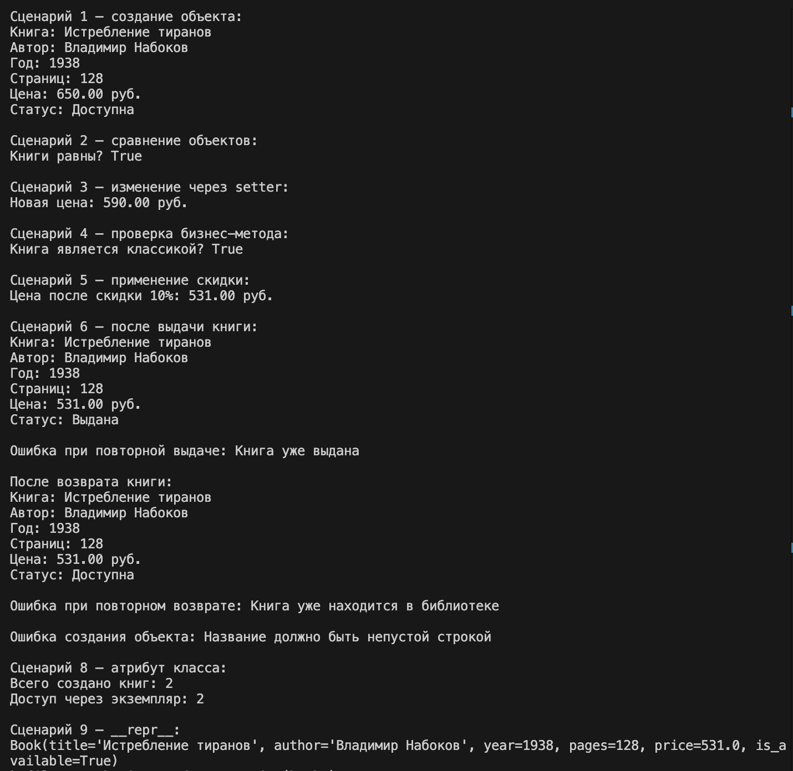

# ЛР-1 — Класс и инкапсуляция (Python 3.x)

## Цель работы

Освоить создание пользовательских классов в Python, изучить инкапсуляцию, свойства (`@property`), магические методы и различие между атрибутами класса и экземпляра.

---

## Предметная область

**Библиотека / Книги**

Выбранная сущность: **`Book`**

---

## Описание класса

В рамках лабораторной работы реализован пользовательский класс `Book`, который описывает книгу в библиотеке.

Каждый объект класса хранит информацию о конкретной книге:
- название;
- автор;
- год издания;
- количество страниц;
- цена;
- доступность книги.

---

## Реализованные возможности

### Атрибуты экземпляра
- `_title` — название книги;
- `_author` — автор;
- `_year` — год издания;
- `_pages` — количество страниц;
- `_price` — цена;
- `_is_available` — доступность книги.

### Атрибут класса
- `total_books` — общее количество созданных объектов класса `Book`.

---

## Инкапсуляция

Инкапсуляция реализована с помощью закрытых атрибутов экземпляра с одним подчёркиванием:
- `_title`
- `_author`
- `_year`
- `_pages`
- `_price`
- `_is_available`

Доступ к этим полям организован через свойства (`@property`), а изменение цены выполняется через setter с валидацией.

---

## Валидация данных

При создании объекта выполняется проверка входных данных.  
Логика проверки вынесена в отдельные методы:
- `_validate_title()`
- `_validate_author()`
- `_validate_year()`
- `_validate_pages()`
- `_validate_price()`

Проверяется:
- корректность типа данных;
- непустая строка для названия и автора;
- допустимый диапазон года издания;
- положительное количество страниц;
- неотрицательная цена.

---

## Свойства (`@property`)

Для чтения атрибутов используются свойства:
- `title`
- `author`
- `year`
- `pages`
- `price`
- `is_available`

Для свойства `price` реализован setter с валидацией:
- нельзя установить отрицательное значение;
- нельзя установить значение неверного типа.

---

## Магические методы

В классе реализованы следующие магические методы:

### `__str__`
Возвращает удобное строковое представление объекта для вывода через `print()`.

### `__repr__`
Возвращает техническое представление объекта, удобное для отладки.

### `__eq__`
Позволяет сравнивать два объекта `Book` по названию, автору и году издания.

---

## Бизнес-методы

### `discount(percent)`
Применяет скидку к цене книги.

### `is_classic()`
Определяет, является ли книга классикой по году издания.

---

## Логическое состояние объекта

В классе реализовано логическое состояние книги:
- книга **доступна**;
- книга **выдана**.

Для управления состоянием используются методы:

### `borrow()`
Выдаёт книгу читателю.  
Если книга уже выдана, вызывается ошибка.

### `return_book()`
Возвращает книгу в библиотеку.  
Если книга уже находится в библиотеке, вызывается ошибка.

Таким образом реализовано поведение, зависящее от состояния объекта.

---

## Демонстрация работы

В файле `demo.py` показаны:
- создание объекта;
- вывод объекта через `print()`;
- сравнение двух объектов;
- изменение цены через setter;
- работа бизнес-методов;
- изменение логического состояния объекта;
- обработка ошибок через `try/except`;
- доступ к атрибуту класса через класс и экземпляр;
- использование `__repr__`.

---

## Структура проекта

```text
python_labs/
├─ README.md
├─ src/
│  ├─ lib/
│  ├─ lab01/
│  │   ├─ model.py
│  │   ├─ validate.py
│  │   └─ demo.py
└─ images/
   └─ lab01/
```

---

## Терминал

