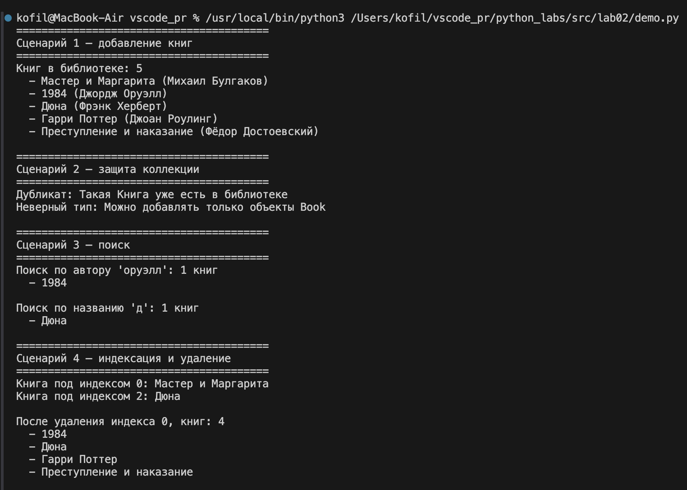
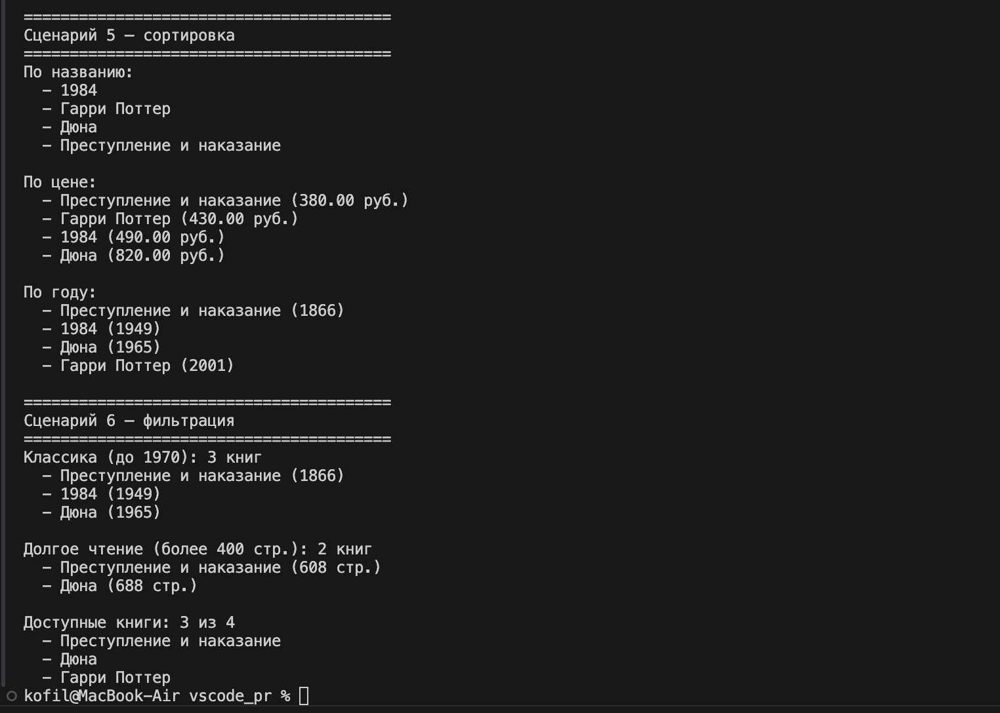

# ЛР-2 — Коллекция объектов (Python 3.x)

## Цель работы

Научиться работать с коллекциями объектов, понять разницу между моделью сущности и контейнером объектов, реализовать собственный контейнерный класс с итерацией и базовыми операциями управления.

---

## Предметная область

**Библиотека / Книги**

Выбранная сущность: **`Book`** → контейнер: **`Library`**

---

## Описание класса

Реализован контейнерный класс `Library`, который хранит объекты `Book` и управляет ими.

---

## Реализованные возможности

### Базовые операции (оценка 3)
- `add(item)` — добавить книгу с проверкой типа и дублей;
- `remove(item)` — удалить книгу;
- `get_all()` — получить список всех книг.

### Поиск и итерация (оценка 4)
- `find_by_title(title)` — поиск по названию (без учёта регистра);
- `find_by_author(author)` — поиск по автору (без учёта регистра);
- `__len__()` — поддержка `len(library)`;
- `__iter__()` — поддержка `for book in library`.

### Расширенные операции (оценка 5)
- `__getitem__(index)` — индексация `library[0]`;
- `remove_at(index)` — удаление по индексу;
- `sort(key)` — универсальная сортировка по любому атрибуту;
- `get_available()` — доступные книги;
- `get_classic()` — книги изданные до 1970 года;
- `get_long_reads(threshold)` — книги длиннее N страниц.

---

## Защита коллекции

- нельзя добавить объект не являющийся `Book`;
- нельзя добавить дубликат (сравнение по названию, автору и году).

---

## Демонстрация работы

В файле `demo.py` показаны 6 сценариев:
- добавление книг и вывод коллекции;
- защита от дублей и неверного типа;
- поиск по автору и названию;
- индексация и удаление по индексу;
- сортировка по названию, цене и году;
- фильтрация по классике, количеству страниц и доступности.

---

## Структура проекта

```text
python_labs/
├─ README.md
├─ src/
│  ├─ lib/
│  ├─ lab01/
│  ├─ lab02/
│  │   ├─ model.py
│  │   ├─ validate.py
│  │   ├─ collection.py
│  │   └─ demo.py
└─ images/
   └─ lab02/
```

---

## Терминал



