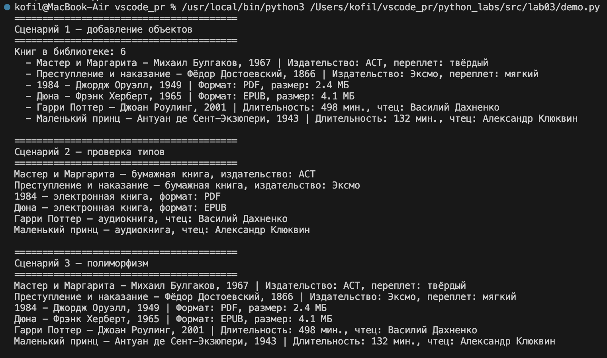
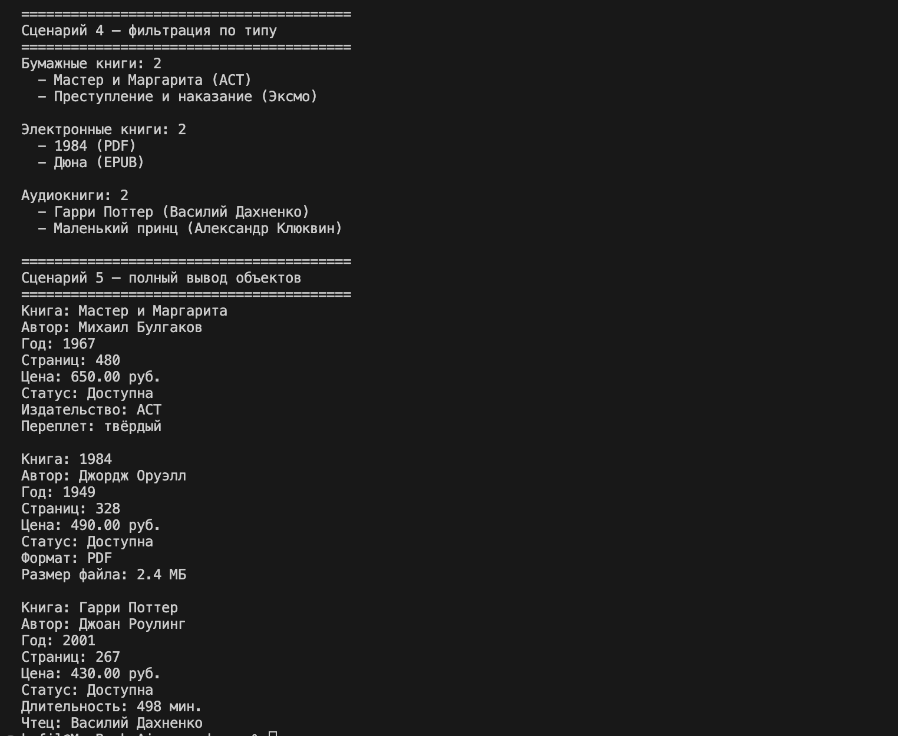

# ЛР-3 — Наследование и иерархия классов (Python 3.x)

## Цель работы

Освоить механизм наследования классов, научиться строить иерархию объектов, понять разницу между базовым и производным классом, освоить переопределение методов и полиморфизм.

---

## Реализованная иерархия

```text
Book
 ├── PrintedBook  — бумажная книга
 ├── Ebook        — электронная книга
 └── AudioBook    — аудиокнига
```

**Базовый класс `Book`** — содержит общие атрибуты: название, автор, год, страницы, цена, доступность. Определяет общий интерфейс через метод `get_info()`.

**`PrintedBook`** — добавляет издательство (`publisher`) и тип переплёта (`cover_type`).

**`Ebook`** — добавляет формат файла (`file_format`) и размер (`file_size`).

**`AudioBook`** — добавляет длительность (`duration`) и имя чтеца (`narrator`).

Каждый дочерний класс переопределяет `get_info()` и `__str__()` — выводит базовую информацию плюс свои уникальные поля.

---

## Демонстрация работы

**Сценарий 1** — добавление объектов разных типов в одну коллекцию и вывод через `get_info()`.

**Сценарий 2** — проверка типов через `isinstance()` и вывод специфичных атрибутов каждого типа.

**Сценарий 3** — полиморфизм без условий: один вызов `get_info()` для всех объектов, каждый отвечает по своему.

**Сценарий 4** — фильтрация коллекции по типу через `get_only_printed()`, `get_only_ebooks()`, `get_only_audiobooks()`.

**Сценарий 5** — полный вывод объектов через `__str__()`.




---

## Вывод

В ходе лабораторной работы было изучено наследование классов в Python — как дочерний класс расширяет базовый через `super()` не дублируя код. Освоен полиморфизм — один метод `get_info()` работает по разному в зависимости от типа объекта. Реализована интеграция с коллекцией из ЛР-2 — коллекция хранит объекты разных типов и умеет фильтровать их по типу.