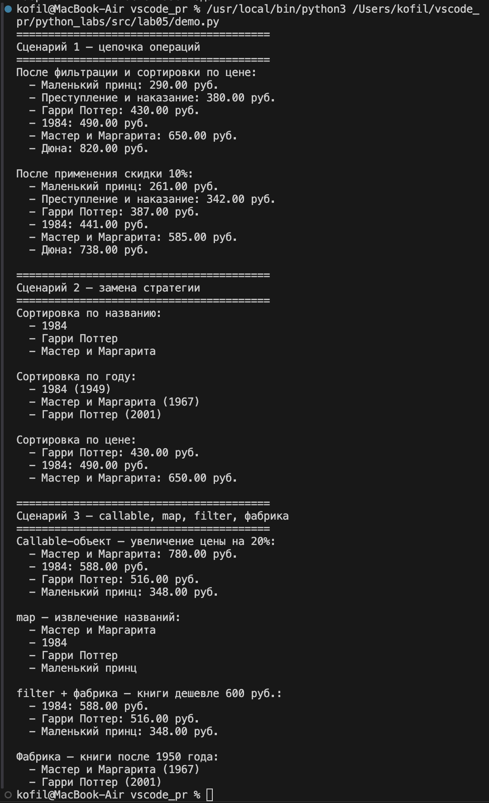

# ЛР-5 — Функции как аргументы. Стратегии и делегаты (Python 3.x)

## Цель работы

Освоить передачу функций как аргументов, применить встроенные функции высшего порядка `map`, `filter`, `sorted`, понять паттерн «Стратегия» и реализовать его через callable-объекты. Интегрировать функциональный стиль с ООП из предыдущих лабораторных.

---

## Реализованные функции и стратегии

### Функции-стратегии для сортировки
- `by_title` — сортировка по названию
- `by_price` — сортировка по цене
- `by_year` — сортировка по году издания

### Функции-фильтры
- `is_available` — только доступные книги
- `is_classic` — только классика (до 1970 года)
- `is_printed` — только бумажные книги

### Фабрики функций
- `make_price_filter(max_price)` — создаёт фильтр по максимальной цене
- `make_year_filter(min_year)` — создаёт фильтр по минимальному году

### Callable-объекты (паттерн Стратегия)
- `DiscountStrategy(percent)` — применяет скидку к цене книги
- `PriceIncreaseStrategy(percent)` — увеличивает цену книги на процент

Callable-объекты реализуют метод `__call__` — это позволяет передавать их как обычные функции в `apply()`.

### Методы коллекции
- `sort_by(key_func)` — сортировка по функции-стратегии
- `filter_by(predicate)` — фильтрация по функции-предикату, возвращает новую коллекцию
- `apply(func)` — применяет функцию ко всем элементам

Все три метода поддерживают цепочки операций.

---

## Демонстрация работы

**Сценарий 1** — полная цепочка `filter_by → sort_by → apply`: фильтрация доступных книг, сортировка по цене, применение скидки 10%.

**Сценарий 2** — замена стратегии без изменения кода коллекции: одна коллекция сортируется тремя разными стратегиями — по названию, году и цене.

**Сценарий 3** — callable-объект, `map`, `filter` и фабрика функций: увеличение цен через `PriceIncreaseStrategy`, извлечение названий через `map`, фильтрация через фабрику `make_price_filter`.

---

## Вывод

В ходе лабораторной работы освоена передача функций как аргументов и применение функций высшего порядка `map` и `filter`. Реализован паттерн «Стратегия» через callable-объекты — стратегия передаётся как аргумент и может быть заменена без изменения кода коллекции. Освоены замыкания через фабрики функций и цепочки операций над коллекцией.