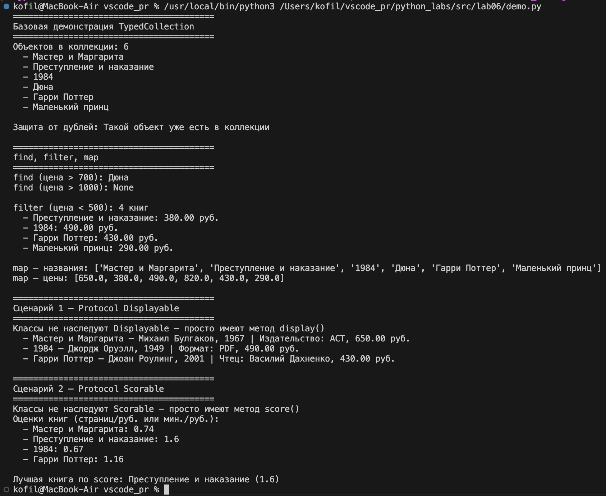

# ЛР-6 — Generics и typing (Python 3.x)

## Цель работы

Освоить систему аннотаций типов в Python, научиться создавать обобщённые (generic) классы с помощью `TypeVar` и `Generic`, понять концепцию структурной типизации через `typing.Protocol`.

---

## Описание реализованных типов и контейнеров

### TypeVar

`T` — универсальный тип, может быть чем угодно.

`R` — тип результата в методе `map`, может отличаться от `T`.

`D` — ограничен протоколом `Displayable`, только объекты с методом `display()`.

`S` — ограничен протоколом `Scorable`, только объекты с методом `score()`.

### Generic-класс TypedCollection

`TypedCollection[T]` — обобщённая коллекция которая знает какой тип внутри хранится. Повторяет интерфейс коллекции из ЛР-2 но с полными аннотациями типов.

Методы:
- `add(item: T)` — добавить объект с защитой от дублей
- `remove(item: T)` — удалить объект
- `get_all()` — получить список всех объектов
- `find(predicate)` — найти первый подходящий объект или `None`
- `filter(predicate)` — получить список всех подходящих объектов
- `map(transform)` — преобразовать каждый объект и получить список результатов

### Протоколы

**`Displayable`** — требует метод `display() -> str`. Классы не наследуют его явно — достаточно что у них есть этот метод. Реализован в `PrintedBook`, `Ebook`, `AudioBook`.

**`Scorable`** — требует метод `score() -> float`. Возвращает числовую оценку объекта. У `PrintedBook` и `Ebook` — соотношение страниц к цене, у `AudioBook` — соотношение длительности к цене.

---

## Демонстрация работы

**Базовая демонстрация** — создание `TypedCollection`, добавление объектов, вывод коллекции, защита от дублей.

**find, filter, map** — поиск первого подходящего объекта, фильтрация по условию, преобразование коллекции в список названий и список цен.

**Сценарий 1** — `TypedCollection` с объектами разных типов из иерархии ЛР-3. Классы не наследуют `Displayable` — просто имеют метод `display()`. Метод вызывается корректно для каждого типа.

**Сценарий 2** — то же самое через протокол `Scorable`. Показана числовая оценка каждой книги и выбор лучшей по `score()`.

---

## Вывод

В ходе лабораторной работы освоены аннотации типов и их роль в читаемости кода. Реализован Generic-класс `TypedCollection` который работает с любым типом объектов. Освоены протоколы — структурный интерфейс без явного наследования. В отличие от ABC из ЛР-4, Protocol не требует наследования — достаточно что у класса есть нужный метод.