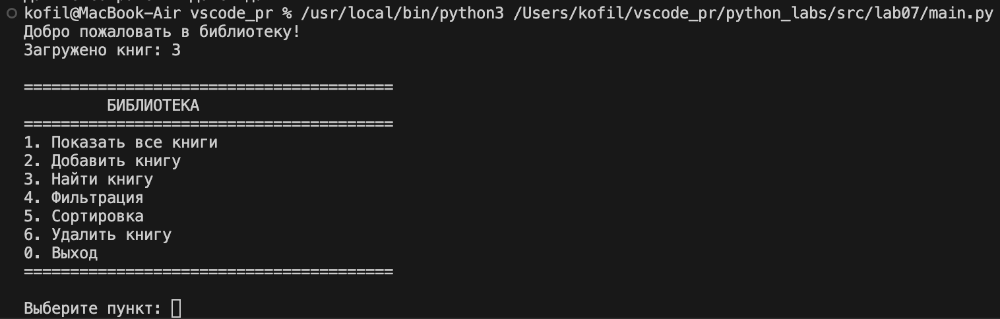
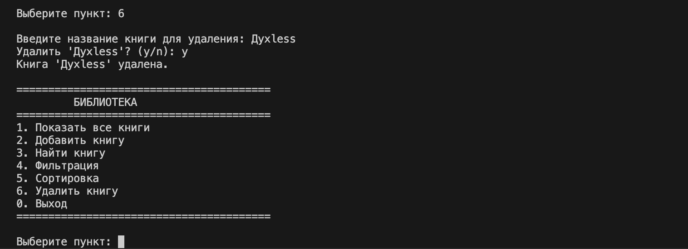
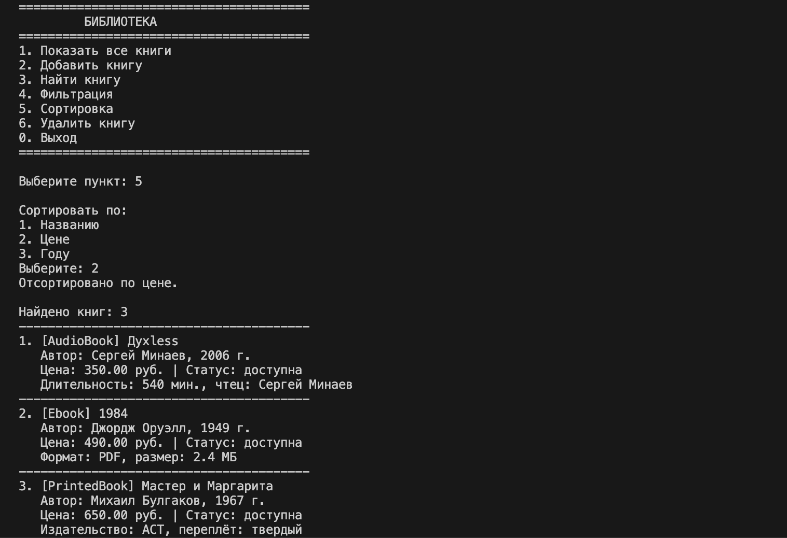
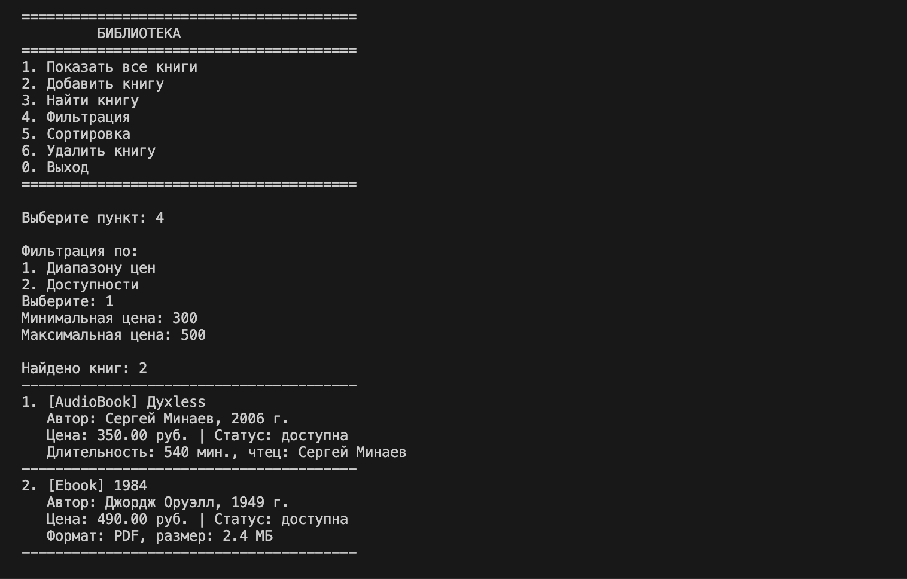
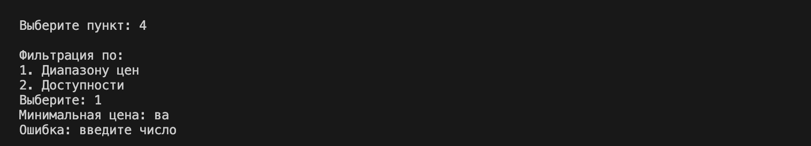

# ЛР-7 — Консольное приложение (Python 3.x)

## Цель работы

Объединить все знания из ЛР1–ЛР6 в единое работающее приложение с интерактивным CLI-интерфейсом, сохранением данных и разбиением на слои.

---

## Структура проекта

```text
lab07/
├── main.py        # точка входа, запуск приложения
├── cli.py         # интерфейс: меню, ввод, вывод
├── app.py         # бизнес-логика, операции над коллекцией
├── exceptions.py  # собственные исключения
├── storage.py     # сохранение и загрузка данных (JSON)
├── model.py       # базовый класс Book
├── models.py      # дочерние классы PrintedBook, Ebook, AudioBook
├── validate.py    # валидаторы
└── library.json   # json-файл 
```

Приложение разбито на три слоя:
- `cli.py` — только ввод и вывод, никакой бизнес-логики
- `app.py` — бизнес-логика, работа с коллекцией
- `models.py` — классы предметной области

---

## Описание CLI

### Пункты меню
    1. Показать все книги
    2.Добавить книгу
    3.Найти книгу
    4.Фильтрация   
    5.Сортировка
    6.Удалить книгу
    7.Выход

### Обработка ошибок
- Ввод строки вместо числа — перехватывается через `ValueError`
- Добавление дубликата — перехватывается через `DuplicateItemError`
- Удаление несуществующей книги — перехватывается через `ItemNotFoundError`
- Некорректный пункт меню — выводится сообщение об ошибке

### Сохранение и загрузка
При запуске приложение автоматически загружает данные из `library.json`. При выходе через пункт 0 данные сохраняются. Формат хранения — JSON с указанием типа каждой книги.

---

## Демонстрация работы

**Сценарий 1** — запуск и автозагрузка данных из файла.



**Сценарий 2** — удаление книги с подтверждением.



**Сценарий 3** — сортировка по цене.



**Сценарий 4** — фильтрация по диапазону цен.



**Сценарий 5** — перехват ошибки при некорректном вводе.



---

[](https://asciinema.org/a/hhb6O0zGZ8GeCk7Q)

## Вывод

В ходе лабораторной работы реализовано полноценное консольное приложение объединяющее все предыдущие лабораторные. Освоено разбиение кода на слои — интерфейс, бизнес-логика, данные. Реализованы собственные исключения, сохранение и загрузка данных через JSON, аннотации типов и docstring во всех методах.